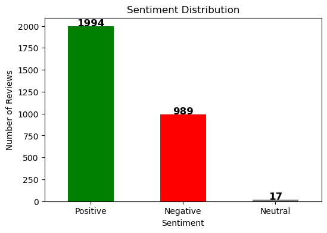
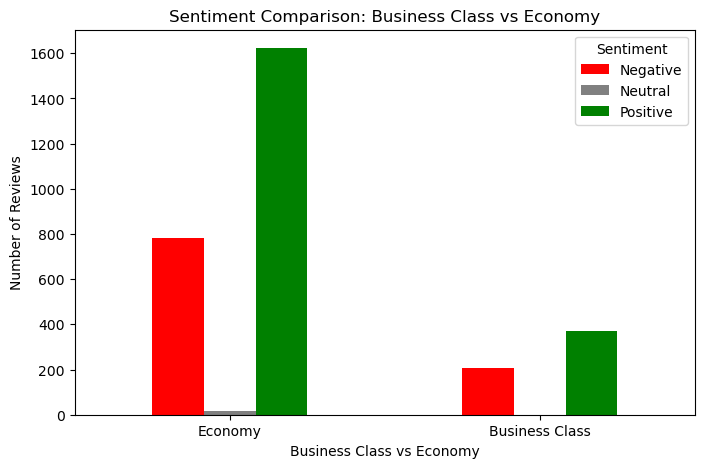
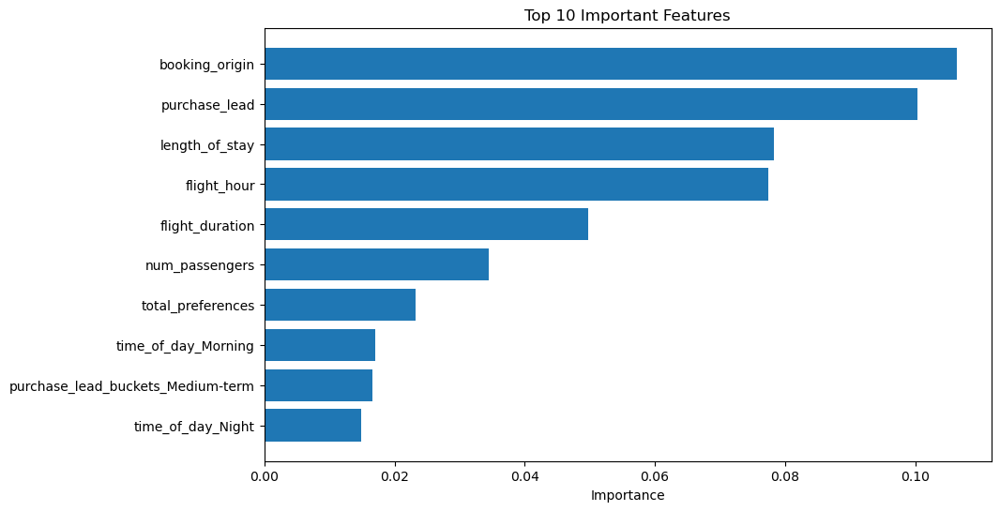

# British-Airways-Data-Science-Job-Simulation-on-Forage---2025

## British Airways Customer Review Analysis - Task 1 Summary

## Sentiment Distribution 📊
Total Reviews Analyzed: 3,000

1994 Positive (66%) 🟢 → Most passengers are satisfied.

989 Negative (33%) 🔴 → A significant portion of travelers are dissatisfied.

17 Neutral (1%) ⚪ → Minimal neutral feedback.

### Key Takeaway: While the majority of customers are happy, nearly 1 in 3 reviews is negative, showing room for improvement.

## Word Cloud Insights - What Are Customers Talking About? ☁️
Most Frequent Words: flight, BA, seat, hour, passenger, business class.

## Possible Customer Priorities:

Seats & Comfort → Frequent mention suggests it's a major concern.

Delays (‘hour’) → Indicates timing issues may be a recurring complaint.

Business Class vs. Economy → Both receive attention, but experiences differ.

## Business vs. Economy Sentiment 💺
Economy Class has both the most positive and the most negative reviews.

Business Class has fewer complaints, suggesting higher satisfaction.

### Key Takeaway: Economy has the most customers, so it dominates both praise and complaints. This signals that while some travelers enjoy the service, many face challenges with comfort, delays, or customer service.

## Key Areas for Improvement 🚀
1. (From Negative Word Cloud Analysis - if applicable)

2. Common Complaints in Negative Reviews:

3. Delays & Timing Issues (frequent mention of “hour”)

4. Seat Comfort (Economy class concerns)

## Customer Service & Communication

Suggested Focus Areas for British Airways:
1. Improve Economy Class experience (comfort, food, service).
2. Reduce delays and improve communication with passengers.
3. Maintain Business Class quality while addressing minor concerns.

📢 Final Recommendations
1. British Airways should prioritize enhancing Economy Class service, as it is the most talked-about category.

2. Customer satisfaction strategies should focus on reducing delays and improving comfort.

3. More research may be needed to explore specific negative trends (e.g., which routes have the most complaints).

# Customer Booking Prediction - Task 2 Model Summary

### Objective: Predict customer booking behavior based on various factors.

## Data Preparation:

Feature Engineering: Transformed flight_hour into "Time of Day" (Morning, Afternoon, Night).

Bucketing: Created buckets for purchase_lead and length_of_stay to categorize booking behaviors (e.g., "Very long-term", "Long stay").

Customer Preferences: Combined wants_extra_baggage, wants_preferred_seat, and wants_in_flight_meals into a single "Total Preferences" feature.

## Model Used:

Random Forest Classifier: Applied to predict booking completion (binary outcome: 1 = Booking complete, 0 = Not completed).

## Model Evaluation:

Accuracy: 85.32%

Precision (for class 1): 53%

Recall (for class 1): 12%

F1-score: 20% (indicating room for improvement in predicting completed bookings).

## Top 10 Features Affecting Booking Prediction:

Booking Origin

Purchase Lead Time

Length of Stay

Flight Hour

Flight Duration

Number of Passengers

Total Preferences (Baggage, Seat, Meals)

Time of Day (Morning)

Purchase Lead Bucket (Medium-Term)

Time of Day (Night)

1. booking_origin: This seems to be a very important feature, indicating that where the booking originates from (perhaps the region or platform) has a significant impact on 
   the likelihood of a booking.

2. purchase_lead: This feature also plays a key role. The time in advance that customers make a booking may provide valuable information for predicting customer behavior.

3. length_of_stay: The duration of the trip is another crucial factor influencing whether a customer books or not.

4. flight_hour: The hour at which the flight is scheduled seems to have an impact, likely indicating certain preferences for times of travel.

5. flight_duration: Longer or shorter flights might be a deciding factor in booking behavior.

6. num_passengers: This feature suggests that the number of passengers also influences the likelihood of a booking.

7. total_preferences: A higher number of preferences (like extra baggage, preferred seating, and in-flight meals) might correlate with more serious or planned bookings.

8. time_of_day_morning and time_of_day_night: These time-related features suggest that the time of day could influence booking behavior, with certain times having higher 
   booking likelihood.

9. purchase_lead_buckets_Medium-Term: The medium-term booking timeframe is a notable feature, suggesting it may capture a specific customer behavior.

## Next Steps:

Address class imbalance in the data (potential solutions: oversampling, undersampling, or advanced techniques like SMOTE).

Fine-tune the model for better recall on class 1 (booked customers).

Further explore and validate the impact of Booking Origin and Purchase Lead on prediction accuracy.
